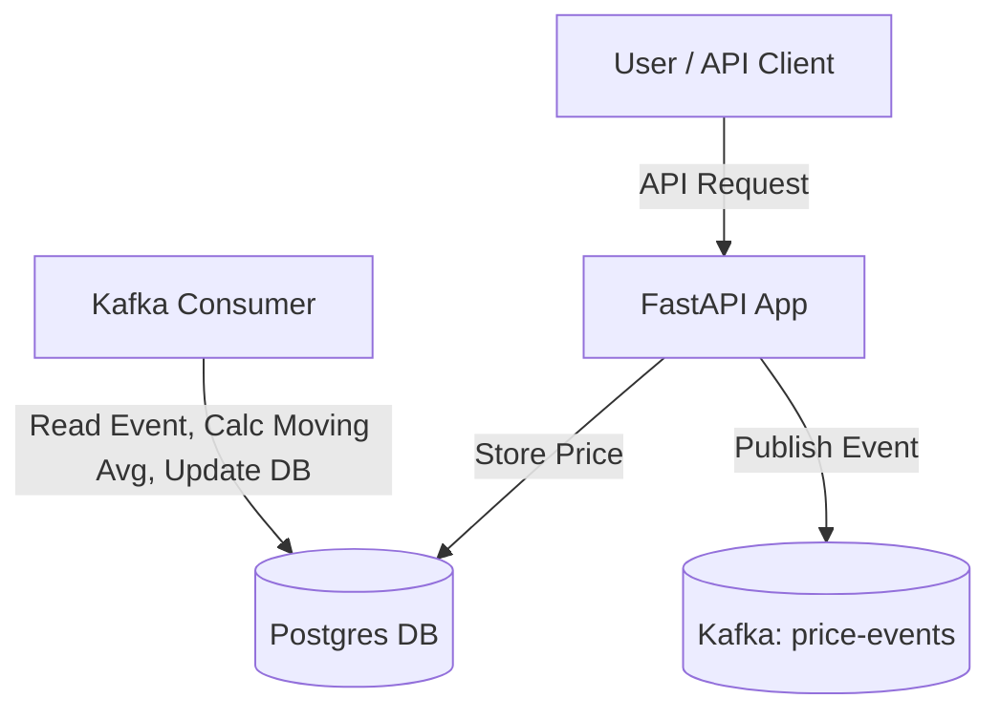

# Blockhouse Market Data Microservice

A production-ready market data microservice using FastAPI, PostgreSQL, Kafka, and Docker.  
*Assignment for Blockhouse Capital*

---

## Table of Contents

* [Overview](#overview)
* [Architecture](#architecture)
* [Setup (Local/Docker)](#setup-localdocker)
* [API Usage](#api-usage)
* [Kafka Pipeline](#kafka-pipeline)
* [Testing](#testing)
* [Troubleshooting](#troubleshooting)
* [Credits](#credits)

---

## Overview

This project is a microservice for fetching, storing, and processing stock market data. It supports real-time data polling, Kafka-based pipelines, and calculates moving averages. Built with production best practices in mind.

**Key Technologies:**

* FastAPI (Python 3.10+)
* PostgreSQL
* Kafka & Zookeeper
* Docker Compose
* yfinance (market data)

---

## Architecture

This project follows a modern, event-driven microservice architecture:

**Components:**

* **FastAPI Backend:** Handles all API requests (fetch price, polling config).
* **PostgreSQL Database:** Stores market prices, polling configs, and moving averages.
* **Kafka Broker:** Streams new price events to decouple data ingestion and processing.
* **Kafka Consumer Service:** Listens to price events, calculates moving averages, and stores results back in the database.

**Data Flow:**

1. **User/API Client** calls an endpoint (e.g., `/prices/latest`).
2. **FastAPI** fetches (and optionally stores) price data.
3. When new data is saved, a **Kafka Event** is produced (`price-events` topic).
4. **Kafka Consumer** listens for new events, fetches last 5 prices for a symbol, calculates a moving average, and writes the result back to **PostgreSQL**.

**Simplified Diagram:**

```
  +---------------------+
  |   User / Client     |
  +----------+----------+
             |
             v
   +---------+--------+
   |    FastAPI       |
   +---------+--------+
             | (DB Write)
             v
   +---------+--------+         +------------------+
   |  PostgreSQL DB   |<------->| Kafka Consumer   |
   +---------+--------+         +--------+---------+
             | (Event)                  ^
             v                          |
        +----+-------+           +------+-------+
        |  Kafka     |<----------+  Producer   |
        +------------+           +--------------+
```

> *See also:* `docs/architecture.png` for a graphical diagram (add your diagram here if required).

---

## Setup (Local/Docker)

### Prerequisites

* Docker & Docker Compose
* Python 3.10+
* \[Optional] `git`, `make`

### 1. Clone the Repository

```bash
git clone https://github.com/<YOUR-USERNAME>/blockhouse-market-data-service.git
cd blockhouse-market-data-service
```

### 2. Environment Variables

Create a `.env` file (or set env vars in your docker-compose.yml):

```
POSTGRES_USER=<YOUR USERNAME>
POSTGRES_PASSWORD=<YOUR PASSWORD>
POSTGRES_DB=marketdata
```

### 3. Start All Services
docker compose up -d
```

### 4. Build & Run FastAPI App (Docker)

docker build -t market-data-api .
docker run -p 8000:8000 --network blockhouse-market-data-service_default market-data-api
```

### 5. (Alternative) Run FastAPI App Locally

python -m venv venv
source venv/bin/activate  # (or .\\venv\\Scripts\\activate on Windows)
pip install -r requirements.txt
uvicorn app.main:app --reload
```

---

## API Usage

Visit the interactive API docs at [http://localhost:8000/docs](http://localhost:8000/docs).

### `GET /prices/latest`

Fetch the latest price for a symbol.

**Example Request:**

```
GET /prices/latest?symbol=AAPL&provider=yfinance
```

**Sample Response:**

```json
{
  "symbol": "AAPL",
  "price": 196.45,
  "timestamp": "2025-06-15T20:30:27.283671",
  "provider": "yfinance"
}
```

### `POST /prices/poll`

Start a polling job for one symbol at a specified interval.

**Example Request:**

```
POST /prices/poll
{
  "symbol": "AAPL",
  "interval_minutes": 60,
  "provider": "yfinance"
}
```

> *Note: If you want to support multiple symbols in one request, update your API model and implementation accordingly.*

**Sample Response:**

```json
{"message": "Polling job scheduled for symbol: AAPL"}
```

---

## Kafka Pipeline

### How It Works

* When new price data is fetched and stored, an event is published to Kafka topic `price-events`.
* A Kafka consumer listens for new events, calculates a 5-point moving average for the symbol, and stores/upserts the result in the `moving_averages` table.

### Kafka Message Example

```json
{
  "symbol": "AAPL",
  "price": 196.45,
  "timestamp": "2025-06-15T20:30:27.283671",
  "provider": "yfinance",
  "raw_response_id": "1"
}
```

### Pipeline Flow



---

## Testing

### Automated Testing

* All unit and integration tests are in the `tests/` directory.
* To run all tests:

  pytest
  ```

  * Example tests:

    * `test_api.py` – Verifies FastAPI endpoints return expected results.
    * `test_moving_average.py` – Verifies moving average calculation logic.

### Manual API Testing

* **Swagger UI**

  * Start all Docker containers and the FastAPI app.
  * Open [http://localhost:8000/docs](http://localhost:8000/docs) in your browser.
  * Use the Swagger interface to test `/prices/latest` and `/prices/poll`.

### Postman/Insomnia

* Import the provided `Blockhouse-Market-Data.postman_collection.json` file into Postman/Insomnia.
* Sample requests for:

  * `GET /prices/latest`
  * `POST /prices/poll`

---

## Docker & Running Locally

# 1. Start all services (Postgres, Kafka, Zookeeper)
docker compose up -d

# 2. Build the FastAPI app Docker image
docker build -t market-data-api .

# 3. Create database tables (run from inside the container)
docker run --rm -it \
  --network blockhouse-market-data-service_default \
  -v "${PWD}:/app" \
  -w /app \
  market-data-api bash -c "PYTHONPATH=/app python scripts/create_tables.py"

# 4. (Optional) Start Kafka consumer for moving average calculation
docker run --rm -it \
  --network blockhouse-market-data-service_default \
  -v "${PWD}:/app" \
  -w /app \
  market-data-api bash -c "PYTHONPATH=/app python scripts/kafka_consumer.py"

# 5. Run the FastAPI app (on port 8000)
docker run -p 8000:8000 \
  --network blockhouse-market-data-service_default \
  market-data-api

# 6. Access the API docs at:
# http://localhost:8000/docs

# 7. Run all tests (local)
python -m pytest

# Or from Docker (optional)
docker run --rm -it \
  --network blockhouse-market-data-service_default \
  -v "${PWD}:/app" \
  -w /app \
  market-data-api bash -c "python -m pytest"

# 8. Run flake8 linter (optional, if using flake8)
flake8 app/

# Or from Docker
docker run --rm -it \
  --network blockhouse-market-data-service_default \
  -v "${PWD}:/app" \
  -w /app \
  market-data-api bash -c "flake8 app/"

# 9. (Optional) Generate OpenAPI docs
#   Just open http://localhost:8000/docs while app is running

# 10. (Optional) Export API collection for Postman/Insomnia
#   Download /openapi.json or export from docs page
---

## Troubleshooting

* **DB/Kafka connection errors**: Ensure all Docker containers are running and your FastAPI container is on the same Docker network.
* **Port conflicts**: Make sure nothing else is running on ports 5432, 9092, 8000, or 2181.
* **Schema errors**: If you change your models, rerun the `create_tables.py` script.
* **Provider/Internet errors**: If yfinance is failing, check your internet connection or try a different symbol.

---

## Credits

* Assignment: Blockhouse Capital
* Author:Anvay Paralikar
* Collaborator: Yuvraj1907 (add as GitHub collaborator)
